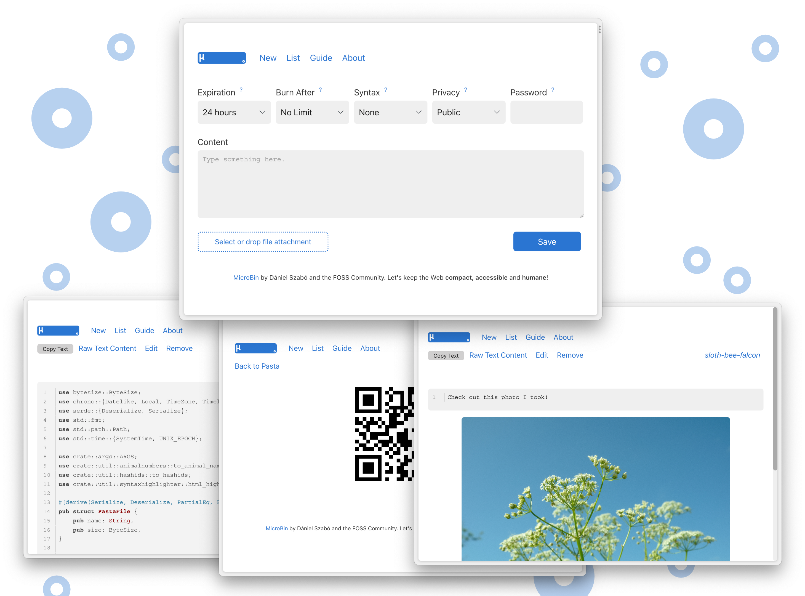

# MicroBin


[](https://crates.io/crates/microbin)
[](https://hub.docker.com/r/danielszabo99/microbin)
[](https://img.shields.io/docker/pulls/danielszabo99/microbin?label=Docker%20pulls)

MicroBin is a super tiny, feature-rich, configurable, self-contained and self-hosted paste bin web application. It is very easy to set up and use, and will only require a few megabytes of memory and disk storage. It takes only a couple minutes to set it up, why not give it a try now?

## Get your own MicroBin server at [my.microbin.eu](https://my.microbin.eu)!

Test MicroBin at [pub.microbin.eu](https://pub.microbin.eu)!

### Or host MicroBin yourself

>[!IMPORTANT]
> #### 🌟 Custom Version (by Karthik)
> This custom build contains added features:
> - **Clipboard Image Paste**: Intercepts images pasted directly in the content area and attaches them as files instead of raw base64.
>- **Custom URL Slugs**: Allows creating notes with a custom text URL (e.g., `/upload/my-note`) with active duplicate slug rejection.
>-
> To pull and run this custom image - Only ARM Compatible:
> ```bash
> docker pull karthikv03/microbin:latest
> ```
> ```bash
> docker run -d \
>  -p 3005:8080 \
>  --name microbin \
>  -v microbin_data:/app/pasta_data \
>  -e MICROBIN_PORT=8080 \
>  -e MICROBIN_JSON_DB=true \
>  -e MICROBIN_ETERNAL_PASTA=true \
>  karthikv03/microbin:latest
>```
> ##### You can also Run the executable file
> ###### Steps
>Step 1. Download the Executable File <br>
>Step 2. Save that Executable File into a folder<br>
>Step 3. Open Command Prompt<br>
>Step 4. Change to the Directory in Command Prompt using "cd" Command<br>
>Step 5: Run the following Code<br>
>```bash
>\microbin.exe --port 3005 --bind 0.0.0.0 --data-dir pasta_data --json-db --eternal-pasta
>```
>Meaning <br>
>--port -> the Port in which the app runs<br>
>--bind -> For which all IP's you want the address to be visible? - Generally recommended to leave as it is <br>
>--pasta-dir -> Directory name in which the files are to be stored <br>
>--json-db -> Directing to use JSON DB <br>
>--eternal-pasta -> Saying that kindly keep the pastes eternally unless user deletes it. <br>
> You can give more such commands based on the admin panel
<br><br><br>
#### 📦 Original Version
Run the quick docker setup script for the official image ([DockerHub](https://hub.docker.com/r/danielszabo99/microbin)):
```bash
bash <(curl -s https://microbin.eu/docker.sh)
```

Or install it manually from [Cargo](https://crates.io/crates/microbin):

```bash
cargo install microbin;
curl -L -O https://raw.githubusercontent.com/szabodanika/microbin/master/.env;
source .env;
microbin
```

On our website [microbin.eu](https://microbin.eu), you will find the following:

- [Screenshots](https://microbin.eu/screenshots/)
- [Guide and Documentation](https://microbin.eu/docs/intro)
- [Roadmap](https://microbin.eu/roadmap)

## Features

- Entirely self-contained executable, MicroBin is a single file!
- Server-side and client-side E2E encryption
- File uploads (e.g. `server.com/file/pig-dog-cat`)
- Raw text serving (e.g. `server.com/raw/pig-dog-cat`)
- QR code support
- URL shortening and redirection
- Animal names instead of random numbers for upload identifiers (64 animals)
- Multiple attachments
- SQLite and JSON database support
- Private and public, editable and uneditable, automatically and never expiring uploads
- Automatic dark mode and custom styling support with very little CSS and only vanilla JS (see [`water.css`](https://github.com/kognise/water.css))
- **Clipboard image paste support** (pasting images directly into the editor textarea attaches them as file uploads instead of inserting base64 strings)
- **Custom URL slugs** (optional user-defined URL slugs with active collision validation and duplicate warning/error display)
- And much more!

## What is an upload?

In MicroBin, an upload can be:

- A text that you want to paste from one machine to another, e.g. some code,
- Files that you want to share, e.g. a video that is too large for Discord, a zip with a code project in it or an image,
- A URL redirection.

## When is MicroBin useful?

You can use MicroBin:

- To send long texts to other people,
- To send large files to other people,
- To share secrets or sensitive documents securely,
- As a URL shortener/redirect service,
- To serve content on the web, eg . configuration files for testing, images, or any other file content using the Raw functionality,
- To move files between your desktop and a server you access from the console,
- As a "postbox" service where people can upload their files or texts, but they cannot see or remove what others sent you,
- Or even to take quick notes.

...and many other things, why not get creative?

MicroBin and MicroBin.eu are available under the [BSD 3-Clause License](LICENSE).
